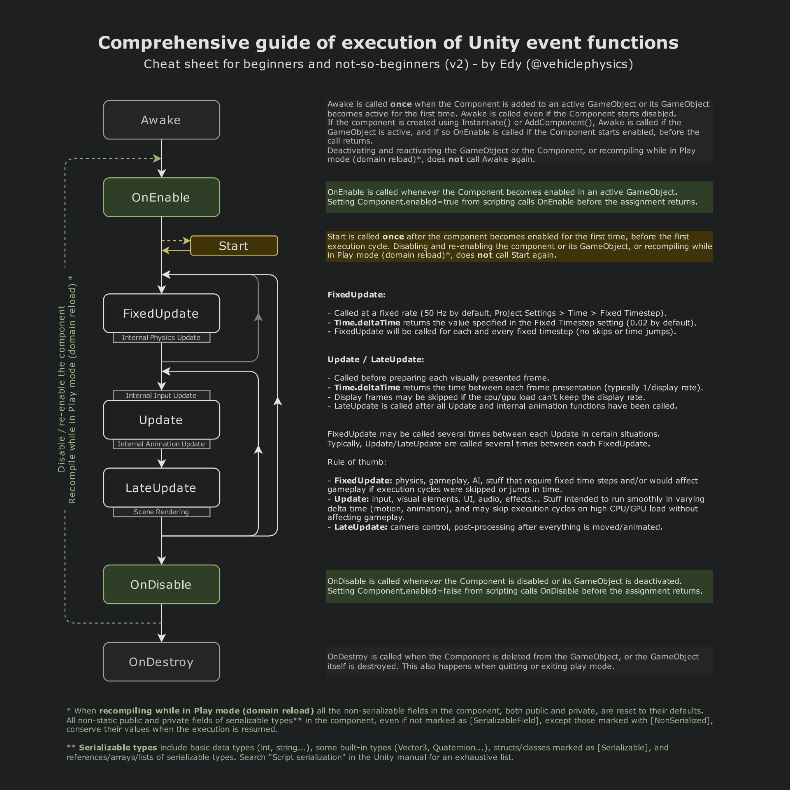

# Unity Design - Week 04

## Agenda

Instantiate Prefabs
1. [Lifecycle of Unity Frame](#Life-Cycle-Frame-Methods)
2. [Scene Management](#Scene-Management)
3. [Key Input / MouseInput](#Key-Mouse-Input)
4. [Random Range](#Random-Range)
5. [Instantiate Prefab](#Instantiate-Prefab)
6. [Video Player](#Unity-Video-Player)  
7. [Audio Basics](#Unity-Audio-Basics)  
8. [Particle System](#Unity-Particle-System)  
9. [Class Assignment - Week #04](#Create-with-Code)  

---
# 🧱 Lifecycle of Unity Frame Events

- **Unity Event Functions Diagram**:  



---

# Unity Scene Management

Scene Management in Unity is the system that controls loading, unloading, and transitioning between different game levels or environments. Scenes are containers for your game’s objects, lighting, UI, and gameplay logic. By mastering scene management, you can build structured projects, create menus, and implement smooth level transitions.

---

## 📖 What is a Scene in Unity?

A **Scene** in Unity is like a stage or level of your game. It holds:

* GameObjects (characters, environments, UI, etc.)
* Components (scripts, physics, colliders, etc.)
* Lighting & rendering data
* Navigation and baked data

Every Unity project starts with a default scene, but you can create as many scenes as needed to organize your game.

---

## ⚙️ Scene Management API

Unity provides the **`UnityEngine.SceneManagement`** namespace to handle scene operations.

### Importing

```csharp
using UnityEngine.SceneManagement;
```

### Common Functions

* **Load a Scene by Name**

  ```csharp
  SceneManager.LoadScene("Level1");
  ```
* **Load a Scene by Build Index**

  ```csharp
  SceneManager.LoadScene(1);
  ```
* **Load Additively (keep current scene active)**

  ```csharp
  SceneManager.LoadScene("UIOverlay", LoadSceneMode.Additive);
  ```
* **Unload a Scene**

  ```csharp
  SceneManager.UnloadSceneAsync("UIOverlay");
  ```
* **Get the Active Scene**

  ```csharp
  Scene activeScene = SceneManager.GetActiveScene();
  Debug.Log("Current Scene: " + activeScene.name);
  ```
  
---

## 🎮 Example: Level Transition Script

```csharp
using UnityEngine;
using UnityEngine.SceneManagement;

public class SceneController : MonoBehaviour
{
    public void LoadLevel(string sceneName)
    {
        SceneManager.LoadScene(sceneName);
    }

}
```

Attach this script to a UI button to handle menu navigation.

---

# Unity Key & Mouse Input in `Update()`

Handling **player input** is a core part of gameplay in Unity. Using the `Update()` frame event, you can check for **keyboard keys** and **mouse clicks** each frame. This allows you to implement movement, shooting, menu navigation, and other interactions.

---

## 🔄 Why Use `Update()` for Input?

The `Update()` method runs **once per frame**, making it ideal for checking input events in real time. Unity’s Input system captures key presses and mouse activity, which you can query inside `Update()`.

---

## ⌨️ Keyboard Input

Unity provides several ways to detect keyboard keys using the `Input` class.

### Common Methods

* **`Input.GetKey`** – returns `true` while the key is held down.
* **`Input.GetKeyDown`** – returns `true` only in the frame the key is pressed.
* **`Input.GetKeyUp`** – returns `true` only in the frame the key is released.

### Example

```csharp
using UnityEngine;

public class PlayerController : MonoBehaviour
{
    void Update()
    {
        // Move left and right
        if (Input.GetKey(KeyCode.A))
            transform.Translate(Vector3.left * Time.deltaTime);

        if (Input.GetKey(KeyCode.D))
            transform.Translate(Vector3.right * Time.deltaTime);

        // Jump (triggered once on key press)
        if (Input.GetKeyDown(KeyCode.Space))
            Debug.Log("Jump!");

        // Quit (triggered once on release)
        if (Input.GetKeyUp(KeyCode.Escape))
            Application.Quit();
    }
}
```

---

## 🖱️ Mouse Input

Mouse input works the same way, with additional support for button clicks and cursor position.

### Mouse Buttons

* `0` → Left button
* `1` → Right button
* `2` → Middle button

### Example

```csharp
void Update()
{
    // Left click (pressed down this frame)
    if (Input.GetMouseButtonDown(0))
        Debug.Log("Left Mouse Button Clicked");

    // Hold right button
    if (Input.GetMouseButton(1))
        Debug.Log("Right Mouse Button Held");

    // Release middle button
    if (Input.GetMouseButtonUp(2))
        Debug.Log("Middle Mouse Button Released");

    // Mouse position in screen space
    Vector3 mousePos = Input.mousePosition;
    Debug.Log("Mouse Position: " + mousePos);
}
```

---

## 🎮 Example: Simple Character Controller

```csharp
using UnityEngine;

public class SimpleController : MonoBehaviour
{
    public float moveSpeed = 5f;

    void Update()
    {
        float moveX = 0f;

        if (Input.GetKey(KeyCode.A))
            moveX = -1f;
        else if (Input.GetKey(KeyCode.D))
            moveX = 1f;

        transform.Translate(new Vector3(moveX, 0, 0) * moveSpeed * Time.deltaTime);

        if (Input.GetMouseButtonDown(0))
            Debug.Log("Player attacked!");
    }
}
```

---

# Unity `Random.Range`

Randomness is essential in game development for creating variety, unpredictability, and replayability. Unity provides the **`Random.Range`** method to generate random numbers for positions, rotations, loot drops, AI behavior, and more.

---

## 🎲 What is `Random.Range`?

`Random.Range` is part of the **`UnityEngine`** namespace. It returns a random number between two specified values.

### Syntax

```csharp
float value = Random.Range(min, max);   // Random float between min [inclusive] and max [inclusive]
int value = Random.Range(min, max);     // Random int between min [inclusive] and max [exclusive]
```

---

## 🔢 Using Random with Floats

When using **floats**, the range is **inclusive** on both ends.

```csharp
void Update()
{
    // Random speed between 1.0 and 5.0
    float randomSpeed = Random.Range(1f, 5f);
    Debug.Log("Random Speed: " + randomSpeed);
}
```

* Returns values like `1.0`, `2.73`, `4.99`, or even `5.0`.

---

## 🔢 Using Random with Integers

When using **integers**, the **minimum is inclusive** but the **maximum is exclusive**.

```csharp
void Start()
{
    // Picks a number from 1, 2, or 3 (never 4)
    int randomChoice = Random.Range(1, 4);
    Debug.Log("Random Choice: " + randomChoice);
}
```

* Useful for dice rolls, selecting random array indices, or choosing random options.

---

## 🎮 Example Use Cases

### 1. Random Position

```csharp
Vector3 randomPos = new Vector3(
    Random.Range(-10f, 10f),
    0f,
    Random.Range(-10f, 10f)
);
transform.position = randomPos;
```

Places the object at a random position within a square area.

---

### 2. Random Enemy Spawn

```csharp
public GameObject[] enemies;

void SpawnEnemy()
{
    int index = Random.Range(0, enemies.Length);
    Instantiate(enemies[index], transform.position, Quaternion.identity);
}
```

Chooses a random enemy prefab to spawn.

---

### 3. Randomized Loot Drop Chance

```csharp
void DropLoot()
{
    float chance = Random.Range(0f, 1f);
    if (chance < 0.25f)
        Debug.Log("Rare Item Dropped!");
    else
        Debug.Log("Common Item Dropped!");
}
```

Gives a **25% chance** to drop a rare item.

---

# Instantiate Prefabs

In Unity, **prefabs** are reusable GameObject templates. The **`Instantiate()`** method allows you to create clones of prefabs at runtime, enabling dynamic spawning of enemies, bullets, items, UI elements, and more.

---

## 🧩 What is a Prefab?

A **Prefab** is a saved GameObject asset in your Unity project that stores:

* Meshes, sprites, or UI elements
* Components (scripts, colliders, physics, etc.)
* Property values and child objects

They serve as **blueprints** that can be reused and instantiated multiple times in a scene.

---

## ⚙️ Instantiating a Prefab

### Syntax

```csharp
Object Instantiate(Object original);
Object Instantiate(Object original, Vector3 position, Quaternion rotation);
Object Instantiate(Object original, Transform parent);
```

---

## 🎮 Example: Basic Instantiation

```csharp
using UnityEngine;

public class Spawner : MonoBehaviour
{
    public GameObject prefab; // Assign in Inspector

    void Start()
    {
        // Spawn prefab at origin
        Instantiate(prefab);
    }
}
```

---

## 📍 Instantiating with Position & Rotation

```csharp
public class Spawner : MonoBehaviour
{
    public GameObject prefab;

    void SpawnAtPoint()
    {
        Vector3 spawnPos = new Vector3(0, 1, 0);
        Quaternion spawnRot = Quaternion.identity;

        Instantiate(prefab, spawnPos, spawnRot);
    }
}
```

* `Quaternion.identity` → default rotation (no rotation).

---

## 🌳 Parenting Instantiated Objects

```csharp
public Transform parentObject;

void SpawnAsChild()
{
    Instantiate(prefab, parentObject);
}
```

Useful for organizing objects under a hierarchy (e.g., bullets under a "BulletContainer").

---

## 🔁 Runtime Examples

### 1. Enemy Spawner

```csharp
public GameObject enemyPrefab;

void Update()
{
    if (Input.GetKeyDown(KeyCode.Space))
    {
        Vector3 randomPos = new Vector3(Random.Range(-5f, 5f), 0, Random.Range(-5f, 5f));
        Instantiate(enemyPrefab, randomPos, Quaternion.identity);
    }
}
```

---

### 2. Shooting Projectiles

```csharp
public GameObject bulletPrefab;
public Transform firePoint;

void Shoot()
{
    Instantiate(bulletPrefab, firePoint.position, firePoint.rotation);
}
```

---

# 🎬 Unity Video Player 

A hands-on guide for using Unity’s **Video Player** component will help you import videos, configure the Video Player, and render clips as full-screen cutscenes or in-world displays.

---

## 🧰 Step 1: Importing a Video
- Test Video File
- https://test-videos.co.uk/bigbuckbunny/mp4-h264
1. Drag your video file into the Unity **Assets** folder.  
2. Select the video asset and review import settings in the **Inspector**:  
   - ✅ **Transcode**: Ensures platform compatibility (recommended).  
   - ✅ **Loop**: Enable if the video should repeat.  

---

## 🎮 Step 2: Add a Video Player Component
1. Create an empty GameObject (`GameObject > Create Empty`).  
2. Rename it `VideoPlayer`.  
3. In the **Inspector**, click **Add Component > Video Player**.  
4. Drag your video clip into the **Video Clip** slot.  

---

## 📺 Step 3: Choose a Render Mode

### 1. **Camera Far/Near Plane**
- Plays video **full-screen** in front of or behind a camera.  
- Perfect for cutscenes or splash screens.  
- Set `Render Mode = Camera Near Plane` or `Far Plane`.  

---

### 2. **Material Override (In-World Screen)**
- Apply video as a **texture** on a 3D object (like a TV screen or billboard).  
- Steps:
  1. Create a **3D Object > Quad**.  
  2. Create a **Material** and assign it to the Quad.  
  3. In Video Player → `Render Mode = Material Override`.  
  4. Assign your Quad’s Mesh Renderer and set the property (e.g. `_MainTex`).  

---

### 3. **Render Texture**
- Flexible method: sends video to a **RenderTexture** asset.  
- Useful for post-processing, UI backgrounds, or custom shaders.  

Steps:  
1. Create **Assets > Create > Render Texture**.  
2. Assign it in Video Player → `Target Texture`.  
3. Use the RenderTexture in any **UI Image** or **Material**.  

---

## 🔧 Step 4: Fixing Aspect Ratio
- If the video looks **stretched**:
  - Adjust Quad’s scale when using Material Override.  
  - Match RenderTexture width/height to the video’s resolution.  

---

## 💡 Tips & Best Practices
- ✅ Always enable **Transcode** for cross-platform support.  
- ✅ Use **Render Texture** for advanced effects (shaders, UI backgrounds).  
- ✅ Keep videos **compressed** for performance (especially mobile).  
- ✅ Use **Material Override** for immersive, in-world playback.  
- ✅ Use **Camera Render** for simple, full-screen cutscenes.  

---

## 🎯 Example Use Cases
- 🎬 **Cutscenes** → Render mode: Camera Near Plane.  
- 📺 **TV/Monitor in scene** → Render mode: Material Override.  
- 🌌 **Background animation** → Render mode: Render Texture + UI Image.  

---

## 📚 References
- 📖 [Unity Manual – Video Player](https://docs.unity3d.com/Manual/VideoPlayer.html)  
- 📖 [Unity Manual – Render Texture](https://docs.unity3d.com/Manual/class-RenderTexture.html)  

---

# 🎵 Unity Audio Basics

This tutorial explains how to add and control **audio in Unity**.  
It covers importing audio clips, using Audio Sources & Listeners, creating spatial sound, mixing, and scripting audio playback.

---

## 📌 What You’ll Learn
- Import audio into Unity.  
- Play sounds with **Audio Source** and **Audio Listener**.  
- Set up **2D vs 3D spatial audio**.  
- Control audio using the **Audio Mixer**.  
- Trigger sounds with **C# scripts**.  

---

## 🧰 Step 1: Importing Audio

1. Drag your audio file (`.wav`, `.mp3`, `.ogg`) into the **Assets** folder.  
2. Select the clip → configure in **Inspector**:
   - ✅ **Loop** → for music or ambient sounds.  
   - ✅ **Load In Background** → avoids freezing during playback.  
   - ✅ **Preload Audio Data** → loads sound on startup.  

---

## 🔊 Step 2: Audio Source

The **Audio Source** plays the sound.  

1. Create a new GameObject → `GameObject > Audio > Audio Source`.  
2. In the **Inspector**, assign your audio clip.  
3. Key options:
   - **Loop** → repeats continuously.  
   - **Play On Awake** → starts automatically.  
   - **Spatial Blend** → choose between **2D (flat)** and **3D (positional)**.  
   
---

## 👂 Step 3: Audio Listener

- The **Audio Listener** represents the “ears” of the player.  
- Unity automatically attaches one to the **Main Camera**.  
- Only one active listener should exist in your scene.  


---

## 🎧 Step 4: 2D vs 3D Spatial Audio

- **2D Audio** → volume and pan are constant (use for UI sounds or music).  
- **3D Audio** → affected by distance and position (use for footsteps, gunfire, ambience).  

⚙️ To set:
- In **Audio Source** → adjust **Spatial Blend**:
  - `0` = 2D  
  - `1` = 3D  


---

## 🎚️ Step 5: Audio Mixer

The **Audio Mixer** allows you to balance music, SFX, and ambience.  

1. Create a Mixer → `Assets > Create > Audio Mixer`.  
2. Add groups (e.g., **Music**, **SFX**, **Ambience**).  
3. Assign an **Audio Source** to a group.  
4. Add effects (Reverb, Low-Pass Filter, Volume control).  

---

## 🧑‍💻 Step 6: Play Audio with Scripts

Example: play/pause audio when pressing **Spacebar**.

```csharp
using UnityEngine;

public class AudioExample : MonoBehaviour
{
    public AudioSource audioSource;

    void Update()
    {
        if (Input.GetKeyDown(KeyCode.Space))
        {
            if (!audioSource.isPlaying)
                audioSource.Play();
            else
                audioSource.Pause();
        }
    }
}
```

---

## 📌 Creative Core: Audio Tutorial
- Adding sound effects and music to games.
- Controlling playback with Unity’s audio system.
- Using the **Audio Source**, **Audio Listener**, and **Audio Mixer**.
- Creating immersive **3D spatial audio**.
- Using **scripts** to trigger sounds dynamically.
- https://learn.unity.com/project/creative-core-audio

---

# 🎇 Unity Particle System 

The **Unity Particle System** is a powerful feature that allows you to create visual effects such as fire, smoke, explosions, rain, sparks, and more.  
This guide provides a **beginner-friendly introduction** to using particle systems in your Unity projects.

---

## 📌 What is a Particle System?

A **particle system** is a collection of small images (called *particles*) that are animated and combined to create dynamic effects.  
Each particle can represent things like smoke puffs, fire sparks, or falling snowflakes.

Particles are controlled by a **Particle System Component**, which defines:
- How particles are emitted (rate, shape, bursts).
- How they look (material, color, size).
- How they behave over time (gravity, velocity, lifetime).

---

## ⚙️ Adding a Particle System

1. **In the Unity Editor**:
   - Right-click in the **Hierarchy** → `Effects` → `Particle System`.
   - A default particle system appears in your Scene.

2. **Adjust the Inspector**:
   - Select the Particle System in the Hierarchy.
   - The **Inspector** shows modules like *Emission, Shape, Size over Lifetime, Renderer,* etc.

---

## 🔑 Core Modules

| Module | Description |
|--------|-------------|
| **Main** | Controls overall settings like duration, looping, start lifetime, speed, size, and color. |
| **Emission** | Defines how many particles spawn per second or in bursts. |
| **Shape** | Determines the emission shape (cone, sphere, box, mesh, etc.). |
| **Velocity over Lifetime** | Adds directional movement to particles. |
| **Size over Lifetime** | Scales particles as they age. |
| **Color over Lifetime** | Gradually changes colors during particle lifespan. |
| **Renderer** | Defines how particles are drawn (material, shader, sorting). |

---

## 🎨 Example Effects

- **Fire** 🔥: Use a **cone shape**, orange/yellow gradient colors, and fast-moving particles.
- **Smoke** 💨: Use a **sphere shape**, gray color gradient with size growing over time.
- **Rain** 🌧️: Use a **box shape**, high emission rate, and downward velocity.
- **Sparkles** ✨: Small particles with random colors and short lifetimes.

---

## 🛠️ Customizing Materials

- By default, particles use Unity’s **Default Particle Material**.
- You can create a **new material** with a shader (e.g., `Particles/Standard Unlit`) and assign a custom texture (like smoke, spark, or snowflake sprite).

---

## 📜 Sample Script Control

You can also control particle systems using **C# scripting**:

```csharp
using UnityEngine;

public class ParticleTrigger : MonoBehaviour
{
    public ParticleSystem ps;

    void Update()
    {
        if (Input.GetKeyDown(KeyCode.Space))
        {
            ps.Play();   // Start particle emission
        }
        if (Input.GetKeyDown(KeyCode.S))
        {
            ps.Stop();   // Stop emission
        }
    }
}
```

---
# Unity Particle Systems 🌟

This project teaches you how to create visual effects like fire, smoke, snow, and rain using Unity’s Particle System. :contentReference[oaicite:0]{index=0}

---

## 🧱 Key Concepts & Components

| Component / Module | Purpose |
|---------------------|---------|
| **Particle System GameObject** | The container in the scene that emits particles. Created via **GameObject → Effects → Particle System** or added as a component. :contentReference[oaicite:5]{index=5} |
| **Main Module** | Core settings: lifetime, start speed, start size, start color, looping, etc. These define how particles behave overall. :contentReference[oaicite:6]{index=6} |
| **Emission Module** | Controls how many particles are emitted, rate over time, burst emission. :contentReference[oaicite:7]{index=7} |
| **Shape Module** | Defines the shape from which particles are emitted (sphere, cone, box, etc.). :contentReference[oaicite:8]{index=8} |
| **Other Modules** | Many additional modules like Velocity over Lifetime, Color over Lifetime, Size over Lifetime, Noise, etc. These let you fine-tune effects. :contentReference[oaicite:9]{index=9} |
| **Simulation Space** | Determines whether particles move in local space (following the emitter) or world space (independent once emitted). :contentReference[oaicite:10]{index=10} |

---

## ⚙️ Hands-On Steps

Here’s a simplified workflow to follow:

1. **Create a Particle System**  
   `GameObject > Effects > Particle System` (or add the component to an existing GameObject).  

2. **Configure the Main Module**  
   - Set **Looping** if you want continuous effects (snow, rain).  
   - Adjust **Start Lifetime**, **Start Speed**, **Start Size** to control how long particles live, how fast, and how big.  
   - Choose **Start Color** for the initial look.  

3. **Adjust Emission & Shape**  
   - Emission → change emission rate or set up bursts.  
   - Shape → select the shape of emission (cone, sphere, box, etc.) and adjust its parameters.  

4. **Preview & Tweak**  
   Move and rotate the emitter, watch how particles behave in real time. Adjust other modules like Color over Lifetime, Size over Lifetime, etc., to refine the visual.  

5. **Use Scripting (Optional but Powerful)**  
   Use code to start, stop, or modify Particle Systems at runtime.  
   Example stub:

```csharp
   using UnityEngine;

   public class ParticleController : MonoBehaviour
   {
       public ParticleSystem ps;

       void Start()
       {
           // Start emission
           ps.Play();
       }

       public void StopParticles()
       {
           ps.Stop();
       }
   }
```

---
   
## 📌 Getting Started: Particle Systems
- What the **Particle System** in Unity is for — visual effects, environmental effects, etc. :contentReference[oaicite:1]{index=1}  
- How to **add** a Particle System to your scene. :contentReference[oaicite:2]{index=2}  
- Core modules and properties of the Particle System (emission, shape, lifetime, speed, etc.). :contentReference[oaicite:3]{index=3}  
- How to script/control Particle Systems via code. :contentReference[oaicite:4]{index=4}  
- https://learn.unity.com/project/getting-started-with-particle-systems

---

## 📌 Assignment Week #4 - Unit 1 Player Control - Apply Media Elements 
- Create a duplicate scene for mobile version of the game. Add on to thesample driving game prototype with video, audio, and/or particle effects. 
- https://learn.unity.com/project/unit-1-driving-simulation?uv=6&courseId=5cf96c41edbc2a2ca6e8810f

